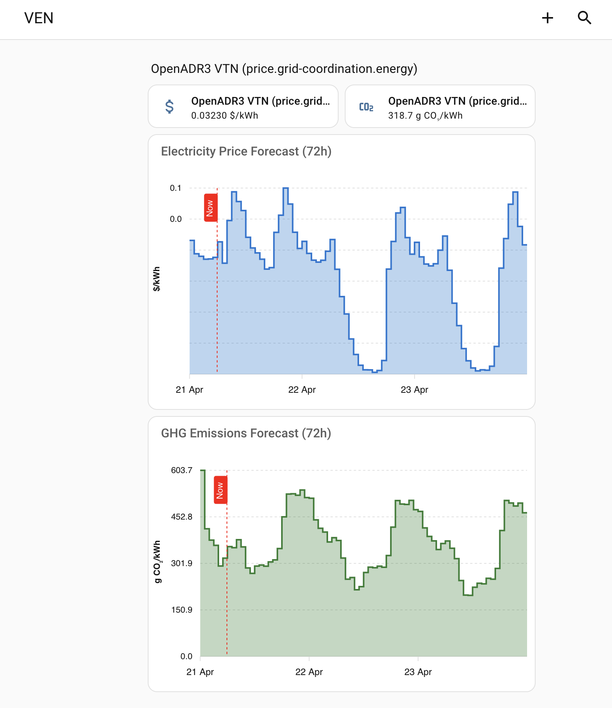

# Dashboard Setup

This guide shows how to visualize the 72-hour price and GHG forecast data using [ApexCharts Card](https://github.com/RomRider/apexcharts-card).

## Prerequisites

Install **ApexCharts Card** via HACS:

1. Open HACS → **Frontend**
2. Search for **ApexCharts Card**
3. Click **Install**
4. Restart Home Assistant

## Adding Forecast Charts

1. Go to your dashboard → three-dot menu → **Edit Dashboard**
2. Three-dot menu → **Raw configuration editor**
3. Add the chart cards under your existing cards

### Electricity Price Forecast

```yaml
- type: custom:apexcharts-card
  header:
    title: Electricity Price Forecast (72h)
    show: true
  graph_span: 72h
  span:
    start: day
  now:
    show: true
    label: Now
    color: red
  series:
    - entity: sensor.openadr3_vtn_price_grid_coordination_energy_eelec_024131103
      name: Price
      data_generator: |
        const forecast = entity.attributes.forecast || [];
        return forecast.map((entry) => {
          return [new Date(entry.datetime).getTime(), entry.value];
        });
      type: area
      curve: stepline
      stroke_width: 2
      color: "#1976D2"
      opacity: 0.3
  yaxis:
    - apex_config:
        title:
          text: "$/kWh"
  apex_config:
    chart:
      height: 300
    tooltip:
      x:
        format: "ddd MMM dd HH:00"
    xaxis:
      type: datetime
```

### GHG Emissions Forecast

```yaml
- type: custom:apexcharts-card
  header:
    title: GHG Emissions Forecast (72h)
    show: true
  graph_span: 72h
  span:
    start: day
  now:
    show: true
    label: Now
    color: red
  series:
    - entity: sensor.openadr3_vtn_price_grid_coordination_energy_moer_pge
      name: MOER
      data_generator: |
        const forecast = entity.attributes.forecast || [];
        return forecast.map((entry) => {
          return [new Date(entry.datetime).getTime(), entry.value];
        });
      type: area
      curve: stepline
      stroke_width: 2
      color: "#2E7D32"
      opacity: 0.3
  yaxis:
    - apex_config:
        title:
          text: "g CO₂/kWh"
  apex_config:
    chart:
      height: 300
    tooltip:
      x:
        format: "ddd MMM dd HH:00"
    xaxis:
      type: datetime
```

## Adapting for Your Sensors

Replace the `entity` value with your actual sensor entity ID. You can find it in **Settings → Devices & Services → OpenADR 3 VEN** → click the device → look at the entity IDs listed.

The `data_generator` works with any sensor created by this integration — it reads the `forecast` attribute which contains hourly data with `datetime` and `value` fields.

## Result



The charts show:
- **72 hours** of forecast data starting from the beginning of today
- A red **"Now"** marker showing the current time
- **Hourly step** values matching the VTN's event intervals
- Daily patterns clearly visible (e.g. solar dip in midday pricing)
