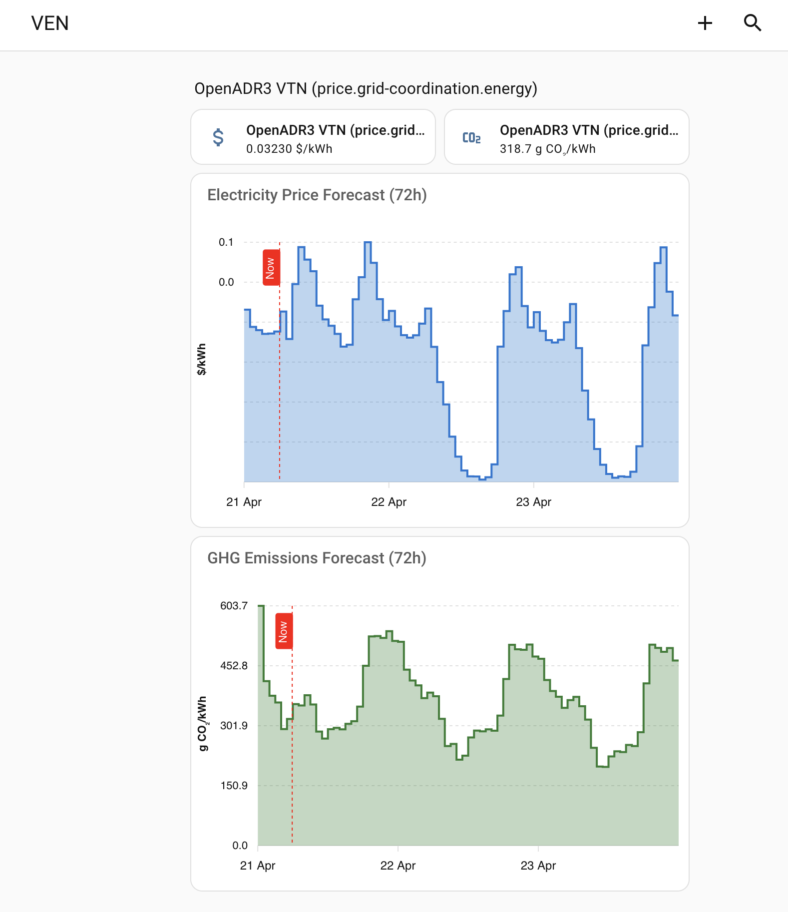

# Dashboard Setup

This guide shows how to build a dashboard with current-value cards and a forecast chart for price, GHG, or any other OpenADR 3 payload type your VTN publishes.

## Prerequisites

Install these frontend cards via HACS (**HACS → Frontend → Search → Install**):

- [**Mushroom Cards**](https://github.com/piitaya/lovelace-mushroom) — clean entity cards for current values
- [**ApexCharts Card**](https://github.com/RomRider/apexcharts-card) — time-series charts for forecast data

Restart Home Assistant after installing.

## How forecast data is exposed (0.4.0+)

Starting with version 0.4.0, this integration does **not** expose the forecast as an entity attribute. Sub-hourly intervals (PT30M, PT15M, PT5M) routinely produce forecasts larger than Home Assistant's 16 KB recorder limit, which would silently disable history persistence for the entity.

Instead, the forecast is returned by a service call: `openadr3_ven.get_forecast`. This matches the pattern Home Assistant uses for its own weather entities (`weather.get_forecasts`). Lovelace cards read the forecast on demand via a `data_generator` that calls the service.

If you are upgrading from 0.3.x and have dashboards using `entity.attributes.forecast`, replace those `data_generator` blocks with the service-call version below.

## Dashboard Layout

The recommended layout uses a **Sections** view with one section per (program, payload type) pair. Each section pairs a Mushroom entity card (current value at a glance) with an ApexCharts forecast chart.

### Creating the Dashboard

1. **Settings → Dashboards → Add Dashboard**
2. Give it a name (e.g. "Grid") and a URL path (e.g. `dashboard-ven`)
3. Choose **Sections** as the view type
4. Add a section per sensor you want to chart

### Section example: Electricity Price

#### Current Price (Mushroom Entity Card)

```yaml
type: custom:mushroom-entity-card
entity: sensor.openadr3_vtn_au_nsw1_ausgrid_ea025_price
name: Price
icon: mdi:currency-usd
```

#### Price Forecast (ApexCharts Card)

```yaml
type: custom:apexcharts-card
header:
  title: Electricity Price Forecast
  show: true
graph_span: 72h
span:
  start: day
now:
  show: true
  label: Now
  color: red
series:
  - entity: sensor.openadr3_vtn_au_nsw1_ausgrid_ea025_price
    name: Price
    data_generator: |
      const response = await hass.callService(
        'openadr3_ven', 'get_forecast',
        { start: start.toISOString(), end: end.toISOString() },
        { entity_id: entity.entity_id },
        false, true
      );
      const result = response.response[entity.entity_id];
      return result.forecast.map(
        (row) => [new Date(row.datetime).getTime(), row.value]
      );
    type: area
    curve: stepline
    stroke_width: 2
    color: "#1976D2"
    opacity: 0.3
yaxis:
  - apex_config:
      title:
        text: "$/kWh"
apex_config:
  chart:
    height: 300
  tooltip:
    x:
      format: "ddd MMM dd HH:mm"
  xaxis:
    type: datetime
```

The key differences from a pre-0.4.0 dashboard:

- `data_generator` calls `hass.callService(...)` with `returnResponse=true` (the trailing `true`) instead of reading `entity.attributes.forecast`.
- The chart's `graph_span` and `span.start = day` are converted into ISO timestamps and passed as the service's `start` / `end` parameters — the integration only returns rows in that window, which keeps the response small even when the underlying forecast is 7 days deep at PT30M.
- `tooltip.x.format` uses `HH:mm` (not `HH:00`) so sub-hourly intervals display the right time.

### Section example: GHG Emissions

```yaml
type: custom:apexcharts-card
header:
  title: GHG Emissions Forecast
  show: true
graph_span: 72h
span:
  start: day
now:
  show: true
  label: Now
  color: red
series:
  - entity: sensor.openadr3_vtn_grid_coordination_energy_moer_pge_ghg
    name: GHG
    data_generator: |
      const response = await hass.callService(
        'openadr3_ven', 'get_forecast',
        { start: start.toISOString(), end: end.toISOString() },
        { entity_id: entity.entity_id },
        false, true
      );
      const result = response.response[entity.entity_id];
      return result.forecast.map(
        (row) => [new Date(row.datetime).getTime(), row.value]
      );
    type: area
    curve: stepline
    stroke_width: 2
    color: "#2E7D32"
    opacity: 0.3
yaxis:
  - apex_config:
      title:
        text: "g CO₂/kWh"
apex_config:
  chart:
    height: 300
  tooltip:
    x:
      format: "ddd MMM dd HH:mm"
  xaxis:
    type: datetime
```

## Adapting for Your Sensors

Replace the `entity` values with your actual sensor entity IDs. Each program publishes one sensor per OpenADR 3 payload type — find them in **Settings → Devices & Services → OpenADR 3 VEN** → click the device. A program that publishes both PRICE and EXPORT_PRICE creates two sensors with `_price` and `_export_price` suffixes on the entity ID.

The same `data_generator` recipe works for any sensor created by this integration. The service returns the full forecast at whatever native granularity the VTN publishes (PT5M, PT30M, PT1H — the chart's stepline curve renders correctly at any cadence).

## Testing the service directly

You can verify the service works without building a dashboard first:

1. **Developer Tools → Services**
2. Service: `openadr3_ven.get_forecast`
3. Target: pick a sensor
4. Call Service

The response panel shows the returned forecast, including `payload_type`, `unit`, and the `forecast` array of `{ datetime, value, interval_minutes }` rows.

## Result



The dashboard shows the current interval's value (Mushroom card) alongside the forecast (ApexCharts). At hourly granularity the chart looks identical to the 0.3.x screenshots; at sub-hourly granularity the stepline picks up the intra-hour shape automatically.
